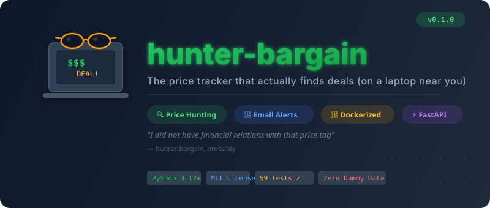

<p align="center">
  
</p>

<p align="center">
  <strong>The price hunter with questionable laptop habits.</strong><br/>
  Scours the internet so you don't have to. Finds deals. Sends alerts. No scandals (probably).
</p>

<p align="center">
  <a href="#quick-start">Quick Start</a> •
  <a href="#features">Features</a> •
  <a href="#cli-usage">CLI</a> •
  <a href="#api-reference">API</a> •
  <a href="#deployment">Deploy</a> •
  <a href="#contributing">Contributing</a>
</p>

---

## What is hunter-bargain?

**hunter-bargain** is an automated price tracking bot that monitors products across multiple search engines and notifies you when prices drop to your target. Add the items you want, set your price, and let the hunter do its thing.

Think of it as a deal-hunting laptop that *actually* does useful work.

### Key Features

- **Multi-engine search** — Queries Google Shopping and Bing Shopping simultaneously via [SerpAPI](https://serpapi.com/)
- **Smart filtering** — Relevance scoring, price floor detection, and accessory filtering so you get actual products, not phone cases
- **Email alerts** — Styled HTML emails with a "Buy Now" button when your target price is hit
- **Scheduled checks** — Automatic daily price checks via APScheduler (configurable cron)
- **On-demand checks** — Trigger a price check anytime via API or CLI
- **CLI tool (`hb`)** — Full item management from your terminal
- **REST API** — FastAPI-powered with auto-generated OpenAPI docs at `/docs`
- **Dockerized** — One command to run the entire stack
- **Zero dummy data** — Every result comes from real search engines

## Quick Start

### Prerequisites

- [Docker](https://docs.docker.com/get-docker/) & Docker Compose
- A free [SerpAPI key](https://serpapi.com/) for search engine access
- SMTP credentials for email alerts (e.g., [Gmail App Password](https://support.google.com/accounts/answer/185833))

### 1. Clone & configure

```bash
git clone https://github.com/gr33ngiant112/hunter-bargain.git
cd hunter-bargain
cp .env.example .env
```

Edit `.env` with your credentials:

```env
SERPAPI_KEY=your-serpapi-key
SMTP_HOST=smtp.gmail.com
SMTP_PORT=587
SMTP_USER=you@gmail.com
SMTP_PASSWORD=your-app-password
EMAIL_FROM=you@gmail.com
ALERT_RECIPIENTS=you@gmail.com
```

### 2. Start

```bash
docker compose up --build -d
```

The API is live at **http://localhost:8000**. Interactive docs at **http://localhost:8000/docs**.

### 3. Track your first item

```bash
# Install the CLI
pip install -e .

# Add an item
hb add "PlayStation 5" -e you@gmail.com -t 399.99 -k "disc edition"

# Check prices now
hb check 1
```

Output:
```
  PlayStation 5: $449.00 (Walmart via google_shopping) — 8 result(s)
    -> https://www.google.com/shopping/product/...
```

## Features

| Feature | Description |
|---------|-------------|
| 🔍 Multi-engine search | Google Shopping + Bing Shopping via SerpAPI |
| 🧠 Relevance filtering | Word overlap scoring, accessory term blocklist, price floor detection, Google Shopping extensions metadata |
| 📧 Email alerts | HTML emails with styled "Buy Now" CTA button + plain text fallback |
| ⏰ Daily scheduler | APScheduler cron job (default: 9 AM UTC, configurable) |
| ⚡ On-demand checks | Check one item or all items instantly |
| 🖥️ CLI (`hb`) | `add`, `rm`, `ls`, `update`, `check` — full CRUD from your terminal |
| 🌐 REST API | FastAPI with Pydantic validation, auto-generated OpenAPI docs |
| 🐳 Docker | Single-container deployment with health checks and volume persistence |
| 📊 Price history | Every price observation persisted to SQLite for trend analysis |

## CLI Usage

The `hb` command manages tracked items through the running API server.

```bash
# Add an item to track (the -e address must be in the server's ALERT_RECIPIENTS)
hb add "iPhone 16 Pro" -e you@example.com -t 899.99 -k "256GB,black,titanium"

# List all tracked items
hb ls

# Update an item's target price
hb update 1 -t 849.99

# Run a price check (single item)
hb check 1

# Run a price check (all items)
hb check

# Remove an item (with confirmation)
hb rm 1

# Remove without confirmation
hb rm 1 -y

# Use a different server
hb --url http://myserver:9000 ls

# Or set via environment variable
export HUNTER_BARGAIN_URL=http://myserver:9000
```

## API Reference

Base URL: `http://localhost:8000/api/v1`

Full interactive documentation available at `http://localhost:8000/docs` (Swagger UI) or `http://localhost:8000/redoc` (ReDoc).

### Items

| Method | Endpoint | Description |
|--------|----------|-------------|
| `POST` | `/items/` | Create a tracked item |
| `GET` | `/items/` | List all tracked items |
| `GET` | `/items/{id}` | Get a specific item |
| `PATCH` | `/items/{id}` | Update an item |
| `DELETE` | `/items/{id}` | Delete an item |

### Price Checks

| Method | Endpoint | Description |
|--------|----------|-------------|
| `POST` | `/prices/check/{id}` | Check prices for one item |
| `POST` | `/prices/check-all` | Check prices for all items |

### Example: Create an item

```bash
curl -X POST http://localhost:8000/api/v1/items/ \
  -H "Content-Type: application/json" \
  -d '{
    "name": "NVIDIA RTX 5090",
    "keywords": "founders edition",
    "target_price": 1999.99,
    "notify_email": "deals@example.com"
  }'
```

`notify_email` must be one of the `ALERT_RECIPIENTS` addresses; create and update return 422 for any other address.
`name` and `keywords` must not contain control characters such as line breaks, tabs or ESC; create and update return 422 if they do.

### Example: Trigger a price check

```bash
curl -X POST http://localhost:8000/api/v1/prices/check/1
```

Response:
```json
{
  "item_id": 1,
  "item_name": "NVIDIA RTX 5090",
  "lowest_price": 2149.00,
  "lowest_source": "google_shopping",
  "lowest_merchant": "Best Buy",
  "lowest_url": "https://www.google.com/shopping/product/...",
  "results_count": 5,
  "records": [...],
  "engine_errors": []
}
```

`engine_errors` lists the engines that could not search, for example `"bing_shopping: HTTP 429, SerpAPI searches used up or hourly limit reached: Your account has run out of searches."`. Those engines' prices are missing from the result, so an empty result with errors does not mean that nothing was found. `hb check` prints each error under its item.

## Architecture

```
src/hunter_bargain/
├── main.py              # FastAPI app with lifespan (scheduler start/stop)
├── config.py            # pydantic-settings from .env
├── db.py                # SQLAlchemy engine, session, Base
├── models.py            # Item, PriceRecord ORM models
├── schemas.py           # Pydantic request/response schemas
├── cli.py               # Click-based CLI (hb command)
├── api/
│   ├── items.py         # CRUD: POST/GET/PATCH/DELETE /api/v1/items
│   └── prices.py        # POST /api/v1/prices/check/{id}, /check-all
└── services/
    ├── searcher.py      # Multi-engine orchestrator + relevance filtering
    ├── notifier.py      # SMTP email alerts with HTML templates
    ├── scheduler.py     # APScheduler daily cron job
    └── engines/
        ├── base.py      # SearchEngine ABC + SearchResult dataclass
        ├── google.py    # Google Shopping via SerpAPI
        └── bing.py      # Bing Shopping via SerpAPI
```

### How It Works

```
User adds item → Stored in SQLite
                       ↓
         Scheduler (daily) or API (on-demand)
                       ↓
         Build search query (name + keywords)
                       ↓
    ┌──────────────────┼──────────────────┐
    Google Shopping    Bing Shopping     (future engines)
    └──────────────────┼──────────────────┘
                       ↓
         Aggregate + Relevance Filter
         (word overlap, price floor, extensions, accessory blocklist)
                       ↓
         Persist price records to SQLite
                       ↓
         Price ≤ target? → Send email alert with Buy Now link
```

## Configuration

All configuration is via environment variables (`.env` file):

| Variable | Default | Description |
|----------|---------|-------------|
| `DATABASE_URL` | `sqlite:///./data/hunter_bargain.db` | SQLAlchemy database URL |
| `SERPAPI_KEY` | — | SerpAPI key (required for searches) |
| `SMTP_HOST` | `smtp.gmail.com` | SMTP server hostname |
| `SMTP_PORT` | `587` | SMTP server port; `465` uses implicit TLS, any other port uses STARTTLS. Both verify the server certificate |
| `SMTP_TIMEOUT` | `30` | Seconds to wait for the SMTP server before giving up |
| `SMTP_USER` | — | SMTP login username |
| `SMTP_PASSWORD` | — | SMTP login password |
| `EMAIL_FROM` | `SMTP_USER` | From address for alerts |
| `ALERT_RECIPIENTS` | — | Comma-separated addresses that may receive alerts, e.g. `me@example.com,you@example.com` (case is ignored for plain ASCII addresses). Item create/update return 422 for any other `notify_email`; alerts for older items with other addresses are skipped and logged. Unset allows no address; an invalid entry stops the app at startup |
| `PRICE_CHECK_CRON` | `0 9 * * *` | Cron schedule for daily checks |
| `APP_HOST` | `0.0.0.0` | Server bind host |
| `APP_PORT` | `8000` | Server bind port |
| `HB_BIND_ADDR` | `127.0.0.1` | Docker Compose only: host address the API port is published on. `0.0.0.0` or the host's LAN address makes the API reachable from your network; it has no authentication of its own |
| `LOG_LEVEL` | `info` | Logging level |

## Deployment

### Docker (recommended)

```bash
docker compose up --build -d
```

- Health check: `curl http://localhost:8000/health`
- SQLite data persisted via Docker volume (`app-data`)
- Container auto-restarts on failure
- By default the port is published on 127.0.0.1 only. On the host, use `curl http://localhost:8000/...` or
  run the CLI inside the container: `docker compose exec app hb ls`. To reach the API from other machines
  on your network, set `HB_BIND_ADDR=0.0.0.0` (or the host's LAN address) in `.env` and run
  `docker compose up -d`. The API has no authentication of its own yet (#1), so do this only on a network
  you trust, or put a reverse proxy with authentication in front.
- To pick up base-image and dependency fixes, rebuild without the cache:
  `docker compose build --pull --no-cache && docker compose up -d`

### Local Development

```bash
python -m venv .venv
source .venv/bin/activate
pip install -e ".[dev]"
uvicorn hunter_bargain.main:app --reload
```

## Development

### Running Tests

```bash
pytest -v                    # Run all tests
pytest -v -k "test_searcher" # Run specific test module
pytest --cov                 # With coverage
```

### Linting

```bash
ruff check .      # Lint
ruff format .     # Format
```

### Project Commands

| Command | Description |
|---------|-------------|
| `pip install -e ".[dev]"` | Install with dev dependencies |
| `docker compose up --build` | Run with Docker |
| `pytest -v` | Run test suite (59 tests) |
| `ruff check .` | Lint check |
| `ruff format .` | Auto-format |
| `hb --help` | CLI usage |

## Tech Stack

| Component | Technology |
|-----------|------------|
| Language | Python 3.12+ |
| Web Framework | [FastAPI](https://fastapi.tiangolo.com/) |
| Database | SQLite via [SQLAlchemy](https://www.sqlalchemy.org/) 2.0 |
| Search | [SerpAPI](https://serpapi.com/) (Google Shopping, Bing Shopping) |
| Scheduling | [APScheduler](https://apscheduler.readthedocs.io/) 3.x |
| Email | stdlib `smtplib` (SMTP/TLS) |
| CLI | [Click](https://click.palletsprojects.com/) |
| Validation | [Pydantic](https://docs.pydantic.dev/) v2 |
| Infrastructure | Docker + Docker Compose |
| Testing | [pytest](https://docs.pytest.org/) |
| Linting | [Ruff](https://docs.astral.sh/ruff/) |

## Roadmap

- [ ] Amazon search engine
- [ ] Price history charts via API
- [ ] Webhook notifications (Slack, Discord)
- [ ] Multi-user support with authentication
- [ ] Browser extension for one-click tracking
- [ ] PostgreSQL support for production deployments

## Contributing

Contributions are welcome! Please read [CONTRIBUTING.md](CONTRIBUTING.md) for guidelines.

## License

This project is licensed under the MIT License — see the [LICENSE](LICENSE) file for details.

## Acknowledgments

- [SerpAPI](https://serpapi.com/) for search engine access
- [FastAPI](https://fastapi.tiangolo.com/) for the excellent web framework
- A certain laptop for the naming inspiration 💻😎

---

<p align="center">
  <sub>Built with questionable judgment and excellent taste in deals.</sub>
</p>
